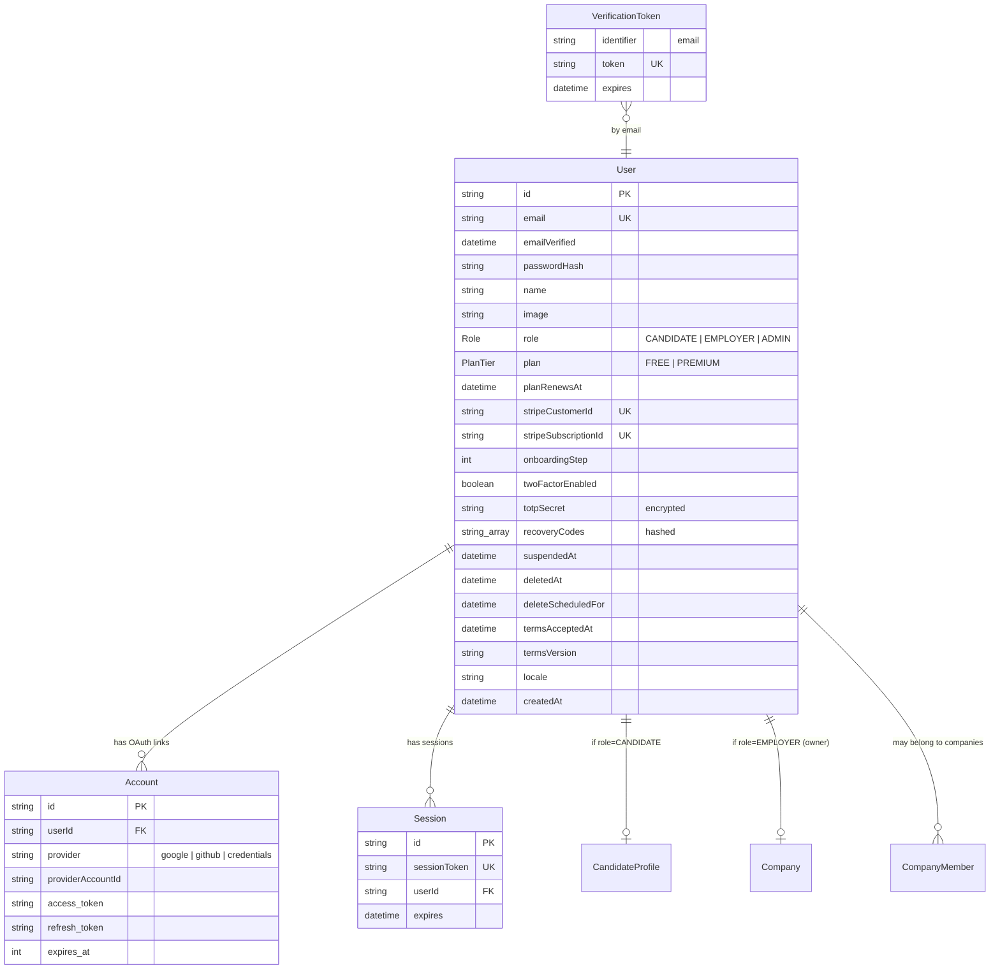
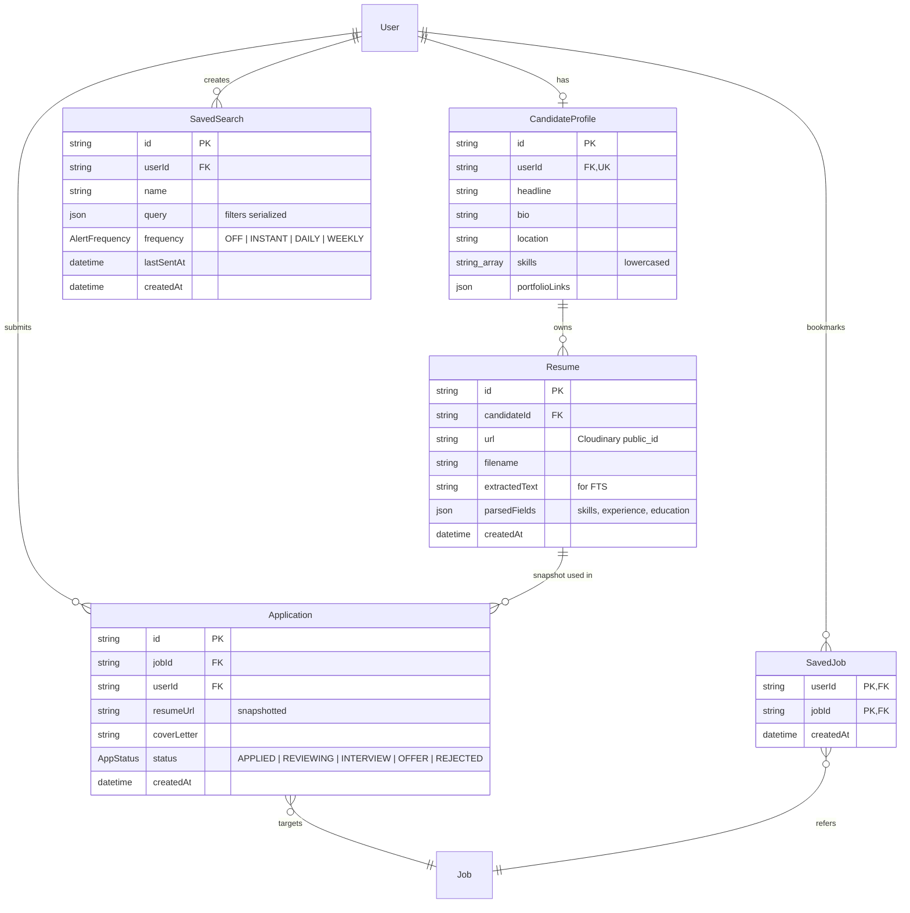
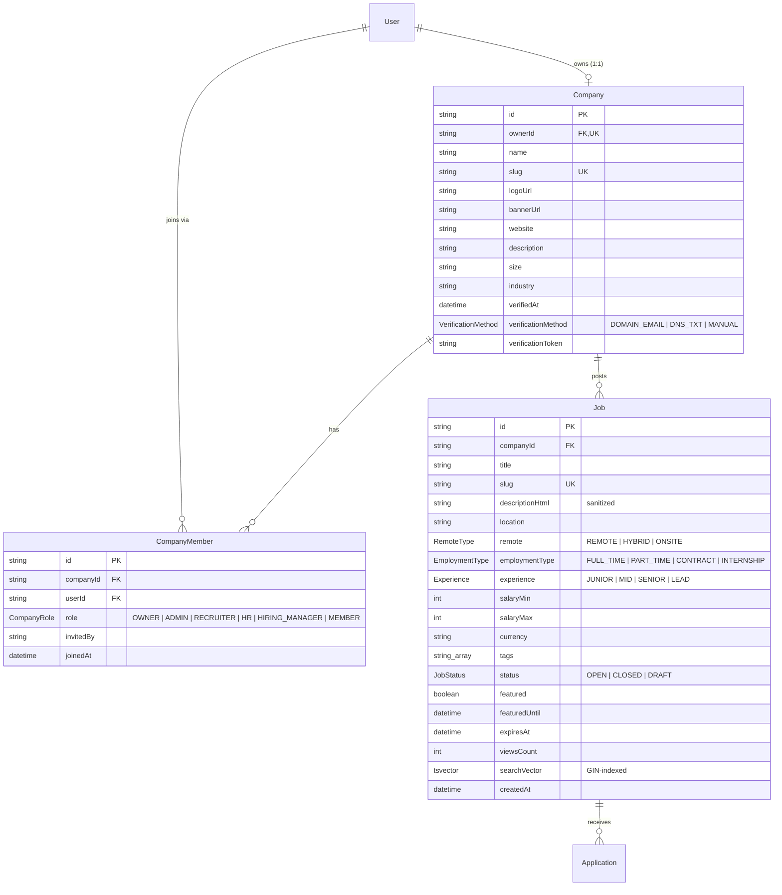
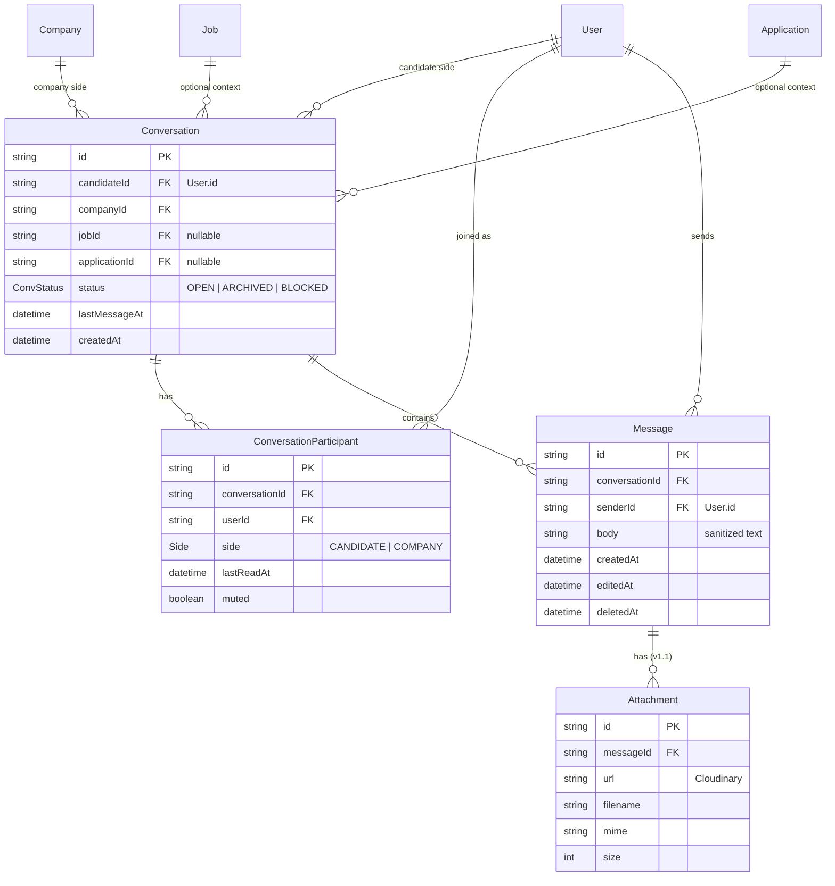
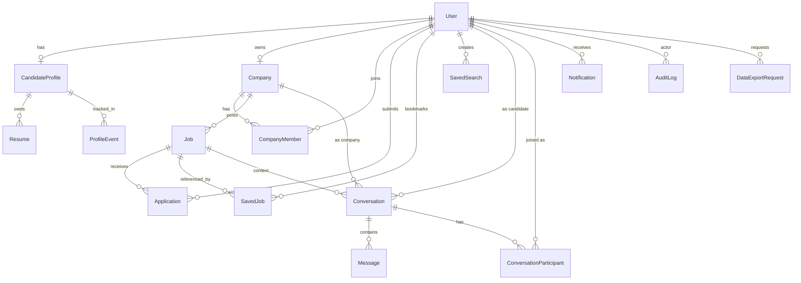

# HireHub — Entity-Relationship Diagram

All Mermaid `erDiagram` blocks render natively on GitHub. The schema is split into 5 logical groups so each is readable; cross-group FKs are annotated under each diagram.

## 1. Identity & Auth

## 2. Candidate side

Cross-group: `Application.userId → User.id`, `SavedJob.userId → User.id`.

## 3. Employer side

## 4. Messaging / Chat

Unique: `Conversation` is unique on `(candidateId, companyId, jobId)` — one thread per candidate-company-job tuple.

## 5. Cross-cutting (events, notifications, audit, GDPR)

```mermaid
erDiagram
    User ||--o{ Notification         : receives
    User ||--o{ AuditLog             : "actor of"
    User ||--o{ DataExportRequest    : requests
    CandidateProfile ||--o{ ProfileEvent : "subject of"
    User ||--o{ ProfileEvent         : "actor (nullable)"
    Company ||--o{ ProfileEvent      : "actor company (nullable)"

    Notification {
        string id PK
        string userId FK
        NotificationType type "PROFILE_VIEW | RESUME_DOWNLOAD | NEW_MESSAGE | APP_STATUS_CHANGE | JOB_MATCH | COMPANY_VERIFIED | SUBSCRIPTION_RENEWED | SUBSCRIPTION_EXPIRING | SYSTEM"
        string title
        string body
        string link
        datetime readAt
        datetime createdAt
    }

    ProfileEvent {
        string id PK
        string candidateId FK
        string actorUserId FK "nullable"
        string actorCompanyId FK "denormalized"
        ActorRole actorRole "RECRUITER | HR | HIRING_MANAGER | OTHER"
        EventType type "PROFILE_VIEW | RESUME_DOWNLOAD | SEARCH_IMPRESSION | CONTACT_CLICK"
        json meta
        datetime createdAt
    }

    AuditLog {
        string id PK
        string actorId FK
        string action
        string target
        string ip
        string userAgent
        json meta
        datetime createdAt
    }

    DataExportRequest {
        string id PK
        string userId FK
        ExportStatus status "PENDING | PROCESSING | READY | FAILED"
        string downloadUrl "signed Cloudinary URL"
        datetime createdAt
        datetime completedAt
    }
```

## 6. Combined high-level overview

This is the same data, abstracted to entity-level relationships only.

## Index notes (not visible in diagrams)

- `Job.searchVector` — GIN index for full-text search.
- `Job(status, createdAt DESC)` — list pagination.
- `ProfileEvent(candidateId, createdAt DESC)` — dashboard reads.
- `Notification(userId, readAt, createdAt DESC)` — bell badge query.
- `Conversation(candidateId, lastMessageAt DESC)` and `(companyId, lastMessageAt DESC)` — inbox lists.
- `Message(conversationId, createdAt)` — thread paging.
- `AuditLog(actorId, createdAt DESC)` and `(action, createdAt DESC)` — admin search.
