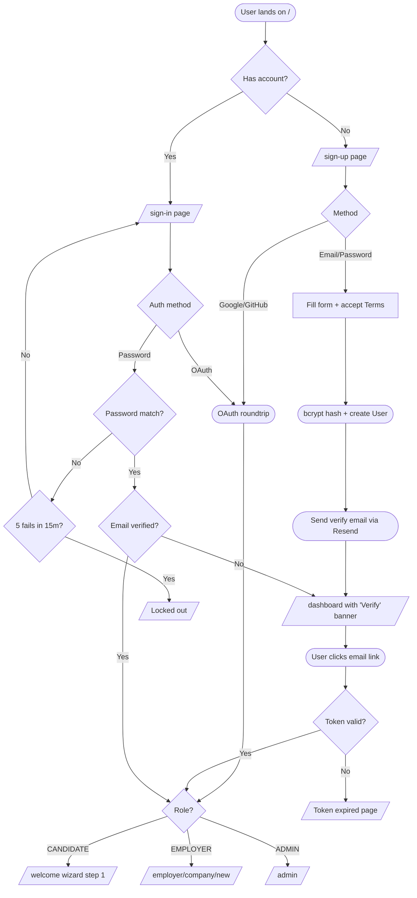
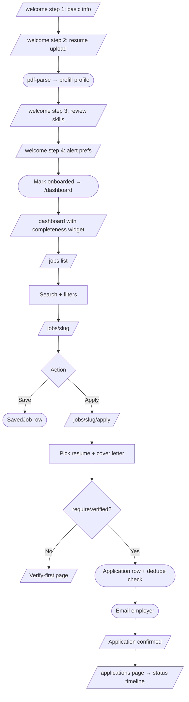
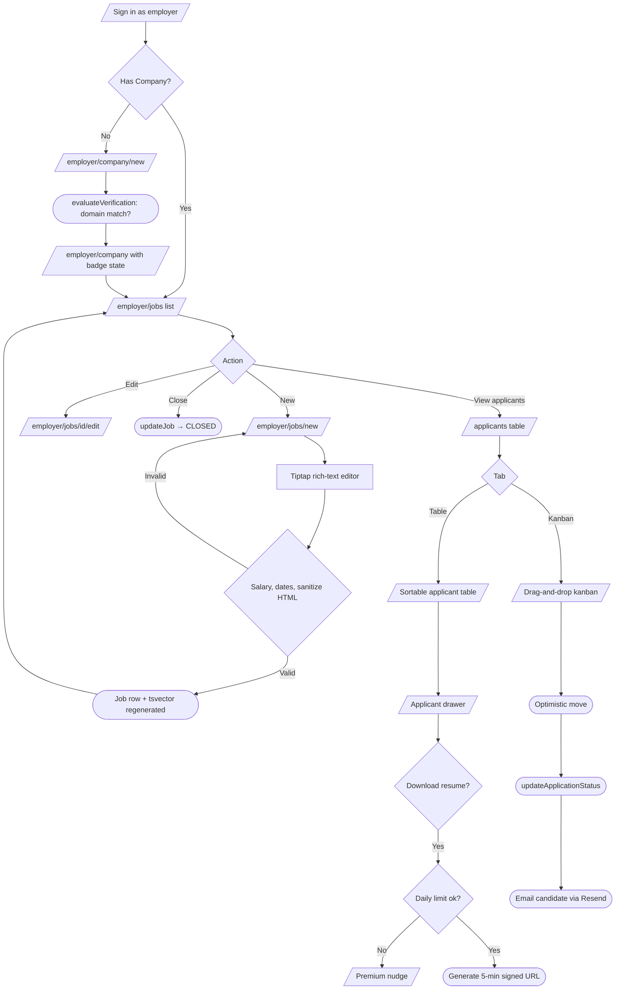
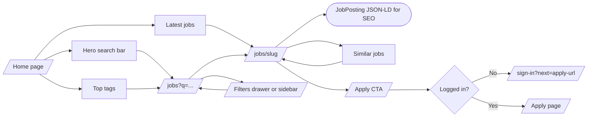
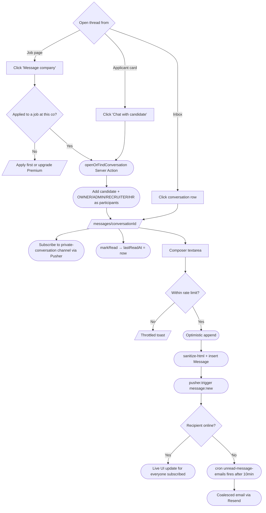
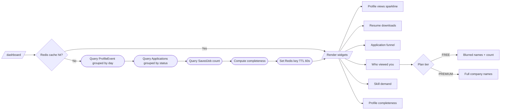
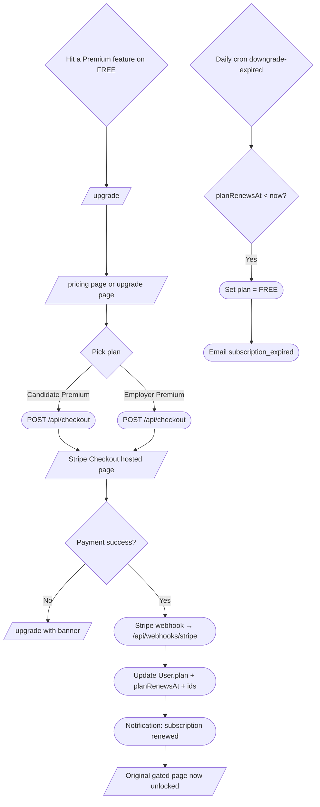
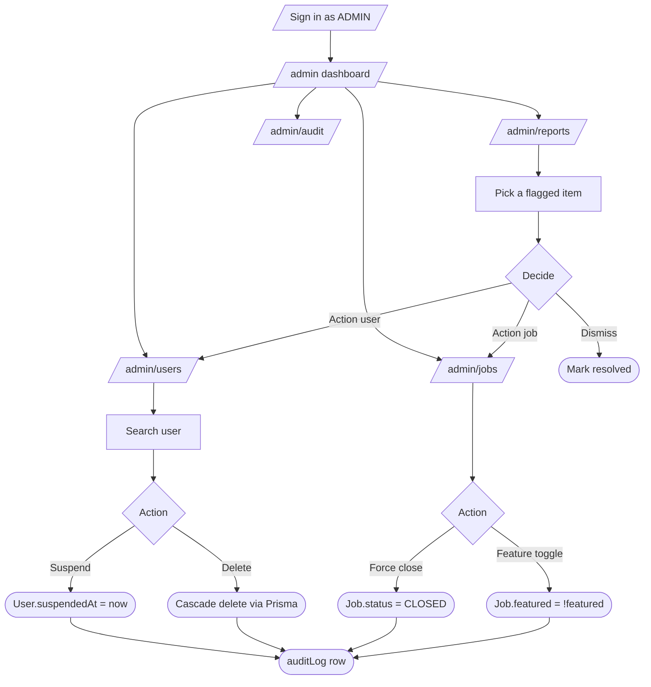
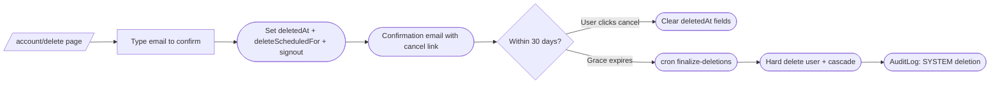
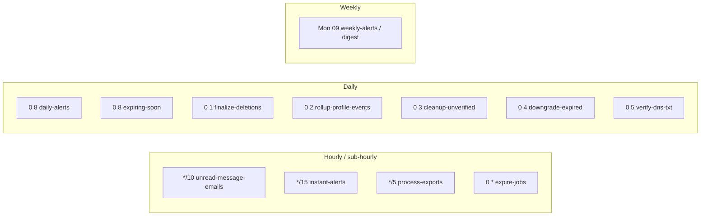

# HireHub — UI Flows

User journeys rendered as Mermaid flowcharts. Each diagram is a separate flow; pages are rectangles, decisions are diamonds, system actions are rounded.

## 1. Sign-up / sign-in / verify

## 2. Candidate onboarding → first apply

## 3. Employer post job → review applicants

## 4. Public job discovery (anonymous + authed)

## 5. Chat (candidate ↔ company)

## 6. Candidate analytics dashboard

## 7. Premium upgrade

## 8. Admin moderation

## 9. GDPR account-deletion lifecycle

## 10. Cron-jobs map (reference)

## How to read these

- **Rectangles** are pages or screens (something the user sees).
- **Rounded rectangles** are system actions (DB writes, emails, webhooks).
- **Diamonds** are decisions/branches.
- Edges are labeled with the trigger or condition.
- Anywhere you see "v1.1" — that path is deferred per the trimmed scope in `PLAN.md`.
